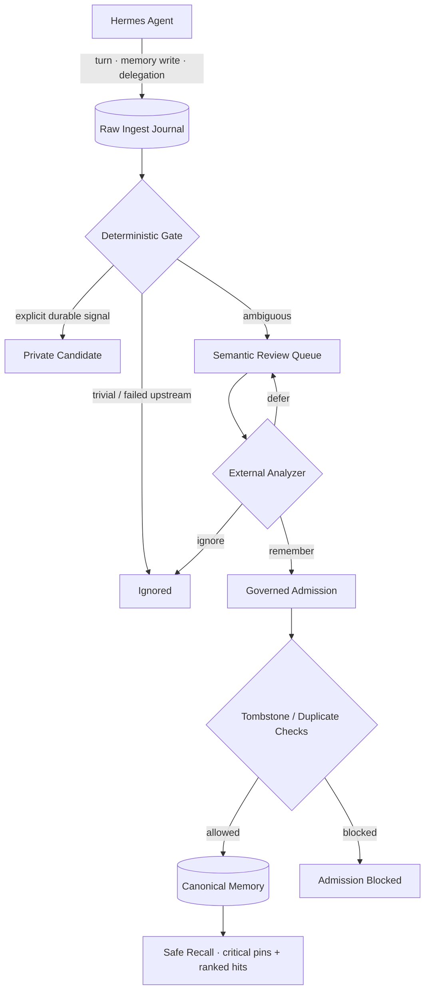
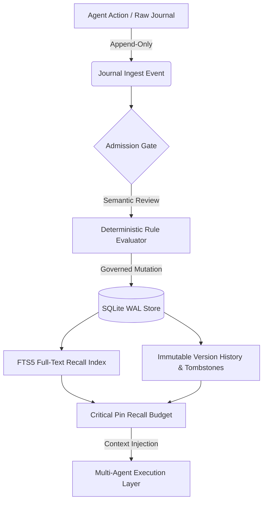

<div align="center">

  <h1>🧠 MemCore</h1>
  <p><strong>Governed, local-first memory for multi-agent Hermes workflows</strong></p>
  <p><em>Capture broadly. Recall narrowly. Never trust raw history.</em></p>

  <p>
    <a href="#-quick-start"></a>
    <a href="https://github.com/Stxyu-p/memcore/releases"></a>
    <a href="https://github.com/NousResearch/hermes-agent"></a>
  </p>

  <p>
    
    
    
    
  </p>

</div>

---

## 🌟 Why MemCore?

Most agent memory stores record everything and trust everything. Raw chat history, tool output, and delegated results become "memory" that resurfaces later with the same authority as a user's explicit decision — and a wrong memory is worse than no memory.

**MemCore is built completely different:**

- 🗄️ **Two lanes, different trust** — raw activity enters an append-only journal; only governed canonical memory is eligible for recall. Raw rows are never injected into prompts.
- 🛡️ **Governance lives in the engine** — scope, lifecycle, verification, and tombstones are enforced in SQL, not delegated to a model's good intentions.
- 🧬 **Corrections never rewrite history** — supersede creates an immutable new version; rejected claims leave tombstones that block silent resurrection.
- ⚡ **Daemonless & local-first** — one SQLite file with WAL + FTS5. No background service, no vector database, no hidden reconciliation worker.
- 🧪 **Fail closed** — ambiguous mutations stay pending; unmatched replace/remove targets are never guessed.

## 📊 Feature Comparison

| Capability | Typical agent memory | "Just dump it in the DB" stores | 🧠 **MemCore** |
| :--- | :---: | :---: | :---: |
| **Raw chat as truth** | ❌ Everything is recallable | ⚠️ Mixed with real facts | ✅ **Journal never recalled directly** |
| **Cross-agent leakage** | ❌ Shared soup | ⚠️ Weak scoping | ✅ **Membership enforced in SQL** |
| **Deleted facts returning** | ❌ Common | ❌ No resurrection guard | ✅ **Scope-aware tombstones** |
| **Corrections destroying history** | ❌ Overwrite in place | ⚠️ Versioned, untrusted | ✅ **Immutable versions + supersede** |
| **LLM self-promotion** | ❌ Analyzer picks scope/lifecycle | ❌ N/A | ✅ **remember → private candidate only** |
| **Trust labels on recall** | ❌ None | ⚠️ Partial | ✅ **scope · lifecycle · verification · freshness per item** |
| **Recall relevance** | ⚠️ Recency-first | ❌ Pin stuffing | ✅ **Critical pins only + ranked hits** |
| **External services** | ❌ Vector DB + daemon | ⚠️ Varies | ✅ **Zero — SQLite + stdlib** |

## 🚀 Key Modules & Architecture



### 1. 🗄️ Governed canonical memory
* **Project / private scope** with membership checks at every read and write boundary.
* **Immutable version chain** — supersede appends history instead of rewriting truth.
* **Tombstone guards** — rejected or corrected claims cannot resurface, even by replay.
* **Trust labels on every recalled line**: `[project | accepted | source_backed | current]`.

### 2. 📥 Raw ingest journal
* Every turn, built-in memory write, and delegation is journaled **before** any analysis.
* Deterministic gate admits explicit durable signals, ignores greetings/acks/probe text, and queues the ambiguous rest.
* Raw rows are never recalled directly — the journal is a source of record, not a prompt.

### 3. 🔬 Governed semantic review
* Optional host-LLM side call (`ctx.llm.complete_structured`) with a strict verdict schema: `remember / ignore / defer` only.
* Analyzers **cannot** choose scope, lifecycle, or verification — attempts are rejected and the event stays pending.
* Bounded batches with a failure circuit breaker; provider outages never become memory-provider failures.
* Trivial turns (greetings, standalone `test`, acknowledgements) never reach the LLM at all.

### 4. 🛡️ Recall that respects the budget
* Only **critical** pins bypass query relevance; ordinary pins compete in ranked hits.
* Oversized facts are skipped whole — never clipped mid-negation.
* The rendered block is hard-capped at the configured character budget, header included.

---

## 🛡️ Safety & governance

```text
candidate ──► accepted
    │            │
    ├──► conflict│
    │            │
    ├──► disabled ──► restored previous lifecycle
    │
    └──► rejected ──► tombstone

accepted/conflict/candidate ──► superseded ──► new immutable version
```

### Important invariants

- **Membership is mandatory** at read and write boundaries.
- **Private memory stays private** to its owner unless project-owner authority applies.
- **Cross-project mutation is blocked**, even when a memory ID is known.
- **Rejected and corrected claims create tombstones** to prevent silent resurrection.
- **Supersede preserves history** instead of rewriting old truth in place.
- **Search returns only current versions** while historical versions remain queryable.
- **Semantic analyzers do not control trust**: `remember` can create only a private `candidate`.
- **Ambiguous Hermes replace/remove operations never use fuzzy matching** — unresolved mutations stay pending instead of risking the wrong target.

---

## 🧩 Hermes integration

```yaml
memory:
  provider: memcore
```

| Capability | Behavior |
|---|---|
| Prefetch | Recalls only canonical governed memory, critical pins + ranked hits |
| Turn sync | Journals the raw turn before analysis |
| Built-in add / replace / remove | Mirrors, exact-origin supersede, reject + tombstone |
| Delegation | Captures raw context without automatic recall |
| Semantic queue | Owner-scoped pending review events only |
| Automatic semantic review | Opt-in bounded host-LLM side call; never enters the tool loop |

When `semantic.auto_review.enabled: true`, a bounded number of new `semantic_review_required` events are reviewed per turn on Hermes' background memory-sync worker. Low-confidence `remember` proposals downgrade to `defer`; failures leave the raw event pending.

---

## 🚀 Quick Start

### 1. Clone

```powershell
git clone https://github.com/Stxyu-p/memcore.git
cd memcore
```

### 2. Initialize / inspect the store

```powershell
python -m memcore doctor
python -m memcore stats
```

### 3. Run the full test suite

```powershell
python -m harness
python -m unittest discover -s integrations/hermes/memcore/tests -v
```

Current gate:

```text
243 tests           →  OK (expected failures=2)
105 integration     →  OK
```

The two expected failures are the legacy E12 token-budget evaluations, which join unbounded rows manually instead of calling the recall builder; the production builder is covered by its own regression tests.

---

## 🧰 Operational CLI

```powershell
# Health and store diagnostics
python -m memcore doctor
python -m memcore stats

# Content-free journal health
python -m memcore journal-stats
python -m memcore journal-review-list --project shared-platform --agent mika
python -m memcore journal-review-decide <event_id> --agent mika --verdict defer --rationale "need more context"

# Garbage collection — dry-run by default
python -m memcore gc
python -m memcore gc --apply

# Preview an import with zero domain writes
python -m memcore import --file batch.json --agent mika --project shared-platform --dry-run
```

`journal-stats` aggregates metadata only — no raw prompt or candidate content. `journal-review-list` keeps raw text redacted unless `--show-content` is explicit, and revealed text is untrusted historical data.

### Hermes plugin deployment

```powershell
python scripts/deploy_hermes_plugin.py --dry-run
python scripts/deploy_hermes_plugin.py
python scripts/deploy_hermes_plugin.py --check
```

Deployment uses an explicit runtime allowlist with SHA-256 verification, so tests, `__pycache__`, and unrelated files never reach the live plugin.

---

## 📁 Repository layout

```text
MemCore/
├── memcore/
│   ├── core.py              # memory lifecycle, search, GC, import, governance
│   ├── ingest.py            # raw journal, mutation bridge, semantic review
│   ├── semantic.py          # provider-agnostic analyzer adapter
│   ├── store.py             # SQLite/WAL configuration and migrations
│   └── __main__.py          # operational CLI + doctor
├── schema/schema.sql        # frozen initial schema contract
├── fixtures/fixtures.py     # deterministic evaluation data
├── harness/                 # engine + CLI + evaluation suites
├── integrations/hermes/     # Git source of truth for the native provider
└── scripts/                 # deployer, benchmarks, scratch builders
```

---

## 🗃️ Storage model

One SQLite database with **WAL** for concurrent readers/writers, **FTS5** for full-text recall, immutable version history, scoped tombstones, audit events, idempotency keys, ingest events, and semantic analysis records.

No mandatory vector database. No memory daemon. No hidden background reconciliation service.

Current migration head: `0013_current_version_ownership`

### 🧭 Dataflow Architecture



### ⚖️ Architectural Comparison: MemCore vs Probabilistic Vector Memory

| Dimension | Generic Agent Vector Memory | 🧠 MemCore (Governed Local-First) |
| :--- | :--- | :--- |
| **Storage Engine** | External vector database or background daemon | **Embedded single-file SQLite with WAL** |
| **Recall Mechanism** | Probabilistic cosine similarity (hallucination-prone) | **Deterministic SQL + FTS5 full-text recall** |
| **Correction & Deletion** | Ghost recall from fuzzy embedding overlap | **Immutable version history with strict tombstone guards** |
| **Governance Gate** | Unaudited auto-insert into vector index | **Journal-first admission with semantic review verdict** |
| **Runtime Overhead** | Heavy embedding services and memory daemons | **Zero-daemon, native Python stdlib + SQLite** |
| **Multi-Agent Isolation**| Flat shared namespace or complex collection filters | **Strict project/agent scoped authorization boundaries** |

---

## 🧪 Project status

| Area | Status |
|---|---|
| Core memory engine · migrations · FTS recall | ✅ Implemented |
| Private/project isolation + tombstone guards | ✅ Implemented |
| Immutable correction history | ✅ Implemented |
| GC / import / doctor CLI | ✅ Implemented |
| Native Hermes provider + verified deployer | ✅ Implemented |
| Raw ingest journal + governed semantic review | ✅ Implemented |
| Automatic host-LLM semantic review (opt-in) | ✅ Implemented |
| Indexed runtime fast paths + circuit breaker | ✅ Implemented |
| Critical-pin recall budget | ✅ Implemented |

---

## 🧭 Design philosophy

MemCore deliberately prefers **uncertainty over unsafe certainty**.

If an event cannot be mapped safely, it stays pending.
If a mutation target cannot be proven exactly, it is not guessed.
If an analyzer wants to remember something, MemCore still applies its own governance.
If a claim was rejected, replay alone cannot silently bring it back.

That makes the system more conservative than a typical agent memory store — intentionally.

---

<div align="center">

### Built for agents that need memory **and** boundaries.

**Local-first · Auditable · Versioned · Governed**

[Back to top](#-memcore)
</div>
