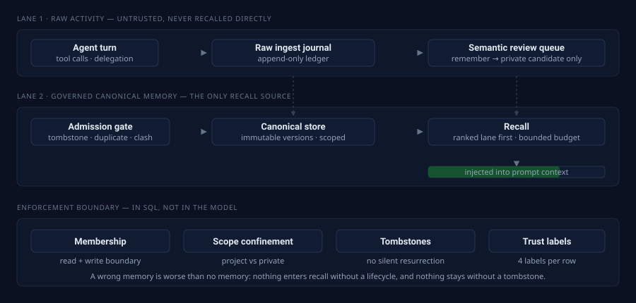

<div align="center">

  <h1>🧠 MemCore</h1>
  <p><strong>Governed, local-first memory for multi-agent AI workflows</strong></p>
  <p><em>Capture broadly. Recall narrowly. Never trust raw history.</em></p>

  <p>
    <a href="#-quick-start"></a>
    <a href="CHANGELOG.md"></a>
    <a href="https://github.com/Stxyu-p/memcore/releases"></a>
    <a href="#-serving-coding-agents"></a>
  </p>

  <p>
    
    
    
    
    
    
    
  </p>

</div>

---

## 🌟 Why MemCore?

Most agent memory stores record everything and trust everything. Raw chat history, tool output, and delegated results become "memory" that resurfaces later with the same authority as a user's explicit decision. A wrong memory is worse than no memory.

MemCore separates them structurally: raw activity goes to an append-only journal that is **never** injected into a prompt, and only governed canonical memory is recallable: always carrying its trust labels.

| Capability | Typical agent memory | "Just dump it in the DB" stores | 🧠 **MemCore** |
| :--- | :---: | :---: | :---: |
| **Raw chat as truth** | ❌ Everything is recallable | ⚠️ Mixed with real facts | ✅ **Journal never recalled directly** |
| **Cross-agent leakage** | ❌ Shared soup | ⚠️ Weak scoping | ✅ **Membership enforced in SQL** |
| **Deleted facts returning** | ❌ Common | ❌ No resurrection guard | ✅ **Scope-aware tombstones** |
| **Corrections destroying history** | ❌ Overwrite in place | ⚠️ Versioned, untrusted | ✅ **Immutable versions + supersede** |
| **LLM self-promotion** | ❌ Analyzer picks scope/lifecycle | ❌ N/A | ✅ **remember → private candidate only** |
| **Trust labels on recall** | ❌ None | ⚠️ Partial | ✅ **scope · lifecycle · verification · freshness per item** |
| **Recall relevance** | ⚠️ Recency-first | ❌ Pin stuffing | ✅ **Ranked lane first + pins bounded to half the budget** |
| **Contradiction handling** | ❌ Silent overwrite | ⚠️ Manual review | ✅ **Refused at admission, good facts never demoted** |
| **External services** | ❌ Vector DB + daemon | ⚠️ Varies | ✅ **Zero: SQLite + stdlib** |

---

## 📐 Architecture



<sub>Two lanes with different trust, and the enforcement boundary between them. Plain SVG, no external dependency.</sub>

| Layer | What it holds | Recall authority |
| :--- | :--- | :--- |
| **Raw journal** | Turns, tool calls, delegations, before any analysis | **None.** Append-only audit trail |
| **Governed canonical memory** | Facts with a lifecycle, a verification state and an owner | **The only recall source**, always labelled |

### 🏛️ Subsystems & Trust Matrix

| Subsystem | Primary function | Core mechanical guarantees | Trust level on recall |
| :--- | :--- | :--- | :--- |
| **🗄️ Canonical store** | Long-term governed knowledge | Scoped project/private access in SQL; immutable version chain; scope-aware tombstones block resurrection | Evaluated and verified: 4 labels per row |
| **📥 Ingest journal** | Append-only raw execution ledger | Captures turns, writes and delegations pre-analysis · deterministic triage · never recalled directly | Raw audit trail (untrusted) |
| **🔬 Semantic review** | Host-LLM triage for ambiguous events | Strict verdict contract (`remember` \| `ignore` \| `defer`) · analyzer cannot pick scope, lifecycle or verification · bounded circuit breaker | Candidate admission (private proposals only) |
| **🛡️ Budgeted recall** | Query-time context injection | Ranked FTS lane before the substring lane · pins bounded to half the budget so they cannot starve hits · oversized facts skipped whole, never clipped | Prompt context deliverable |

---

## 🔐 Trust model

Every recalled row carries four labels, so a reader never has to guess how much to trust it:

| Label | Values | Meaning |
| :--- | :--- | :--- |
| **scope** | `project` · `private` | Who may read it. Private stays with its owner unless project-owner authority applies |
| **lifecycle** | `candidate` · `accepted` · `conflict` · `rejected` · `superseded` · `disabled` | Whether the claim is live. Only the first three are recallable |
| **verification** | `user_authoritative` · `runtime_verified` · `source_backed` · `unverified` | Who vouched for it |
| **freshness** | `current` · `aging` · `stale` | Age signal, projected at read time and always consistent with a real decay sweep |

### Lifecycle transitions

| From | Event | To | Side effect |
| :--- | :--- | :--- | :--- |
| `candidate` | governed accept | `accepted` | Eligible for full recall |
| `candidate` · `accepted` | contradiction with live memory | `conflict` | Both sides audited; nothing auto-resolves |
| `accepted` | contradicted by a **refused** new write | stays `accepted` | Only the refused row is demoted: a bad write cannot destroy a good fact |
| `candidate` · `accepted` · `conflict` | disable | `disabled` | Reversible, restores the previous lifecycle |
| `candidate` · `accepted` · `conflict` | reject | `rejected` | Writes a tombstone for the claim fingerprint |
| `accepted` · `conflict` · `candidate` | supersede | `superseded` | New immutable version; the old one stays queryable |
| ≥3 independent sources | corroboration | stays `accepted`, verification promoted | The only automated promotion route |

### Invariants

- **Membership is mandatory** at read and write boundaries: including export.
- **Private memory stays private** to its owner.
- **Cross-project mutation is blocked**, even when the memory ID is known.
- **Rejected and corrected claims create tombstones** that prevent silent resurrection.
- **Supersede preserves history** instead of rewriting old truth in place.
- **Search returns only current versions**; historical versions remain queryable by timestamp.
- **Semantic analyzers do not control trust**: `remember` can create only a private `candidate`.
- **Ambiguous replace/remove operations never use fuzzy matching**; unresolved mutations stay pending instead of risking the wrong target.
- **A real decay sweep is never second-guessed** by the read-time projection.
- **A refused write cannot demote an established fact**: otherwise one bad agent write would poison the fleet's memory unrecoverably.

---

## 🚀 Quick Start

```bash
git clone https://github.com/Stxyu-p/memcore.git
cd memcore

# Inspect store health and operational stats
python -m memcore doctor
python -m memcore stats

# Run the engine suite and the recall baseline
python -m harness

# Run the Hermes adapter suite
python -m unittest discover -s integrations/hermes/memcore/tests
```

### Measured today

| Gate | Result |
| :--- | :--- |
| `python -m harness` | **479 tests OK** (2 expected failures) |
| Hermes integration suite | **94 tests OK** |
| Total | **573 tests** |
| Recall baseline | **p@3 = 0.81** (floor 0.62) |
| Dependencies | **stdlib only** |
| CI | GitHub Actions, Python 3.13 + 3.14 |

The 2 expected failures are the legacy E12 token-budget evaluations: they join unbounded rows manually instead of calling the production recall builder, which has its own regression tests. Counts are what the two commands report today, not a running total.

---

## 📤 Serving coding agents

MemCore exports governed project memory into shared agent instructions, so coding agents working side by side can read the same source of truth. The default target is `AGENTS.md`. Select a host when its native convention is different. Export is on demand and local, with no daemon, port, MCP server, or new dependency.

<table width="100%">
  <tr>
    <td align="center" width="25%"><br /><sub>Antigravity</sub></td>
    <td align="center" width="25%"><br /><sub>Codex</sub></td>
    <td align="center" width="25%"><br /><sub>Claude Code</sub></td>
    <td align="center" width="25%"><br /><sub>Cursor</sub></td>
  </tr>
  <tr>
    <td align="center" width="25%"><br /><sub>DeepSeek Harness</sub></td>
    <td align="center" width="25%"><br /><sub>ZCode</sub></td>
    <td align="center" width="25%"><br /><sub>Hermes</sub></td>
    <td align="center" width="25%"><br /><sub>OpenCode</sub></td>
  </tr>
  <tr>
    <td align="center" width="25%"><br /><sub>Gemini CLI</sub></td>
    <td align="center" width="25%"><br /><sub>Windsurf</sub></td>
    <td align="center" width="25%"><br /><sub>Cline</sub></td>
    <td align="center" width="25%"><br /><sub>GitHub Copilot</sub></td>
  </tr>
</table>

<sub>Selected agent instruction-file targets. Brand marks are credited in <code>assets/agents/README.txt</code>. This grid identifies supported targets, not an endorsement by the listed vendors.</sub>

```bash
# Shared instructions for agents that read AGENTS.md
python -m memcore export

# Native instruction files
python -m memcore export --host claude-code  # CLAUDE.md
python -m memcore export --host gemini-cli   # GEMINI.md
python -m memcore export --host copilot      # .github/copilot-instructions.md

# One copy at each distinct supported target
python -m memcore export --host all

# Write into another repo, or preview without touching files
python -m memcore export --out-dir ../other-repo --host codex
python -m memcore export --stdout
```

| Agent | Export target | Host selector |
| :--- | :--- | :--- |
| Antigravity | `AGENTS.md` | `antigravity` |
| Codex | `AGENTS.md` | `codex` |
| Claude Code | `CLAUDE.md` | `claude-code` |
| Cursor | `AGENTS.md` | `cursor` |
| DeepSeek Harness | `AGENTS.md` | `deepseek-harness` |
| ZCode | `AGENTS.md` | `zcode` |
| Hermes | `AGENTS.md` | `hermes` |
| OpenCode | `AGENTS.md` | `opencode` |
| Gemini CLI | `GEMINI.md` | `gemini-cli` |
| Windsurf | `AGENTS.md` | `windsurf` |
| Cline | `AGENTS.md` | `cline` |
| GitHub Copilot | `.github/copilot-instructions.md` | `copilot` |

Other supported aliases include `agy`, `claude`, `gemini`, `harness`, `dsh`, `deepseek`, `github-copilot`, `kilocode`, `roo`, `memory`, and `generic`. Harness refers to **DeepSeek Harness**. Less-used Freebuff is intentionally omitted.

First-party instruction-file documentation: [Codex](https://developers.openai.com/codex/agent-configuration/agents-md), [Cursor](https://cursor.com/docs/rules), [Antigravity](https://antigravity.google/docs/rules/), [DeepSeek Harness](https://github.com/deepseek-ai/deepseek-harness/tree/master/packages/context/agent-instructions), [ZCode](https://zcode.z.ai/en/docs/agents), [Hermes](https://hermes-agent.nousresearch.com/docs/user-guide/features/context-files), [GitHub Copilot](https://docs.github.com/en/copilot/how-tos/copilot-cli/customize-copilot/add-custom-instructions), [Gemini CLI](https://geminicli.com/docs/cli/gemini-md/), [Windsurf](https://docs.devin.ai/desktop/cascade/agents-md), [Cline](https://docs.cline.bot/customization/cline-rules), and [OpenCode](https://opencode.ai/docs/rules/). See also [MemCore host targets](memcore/export.py).

**Codex, Cursor, Antigravity, DeepSeek Harness, ZCode, Hermes, Windsurf, Cline, and OpenCode** read `AGENTS.md`. Gemini CLI defaults to `GEMINI.md`. Claude Code reads `CLAUDE.md`. GitHub Copilot supports both `AGENTS.md` and `.github/copilot-instructions.md`; this export uses the native repository-wide `.github/copilot-instructions.md` target.

| Flag | Effect |
| :--- | :--- |
| `--host` | Select an agent target or `all`. Default is `AGENTS.md` |
| `--out` | Explicit output file; overrides the host convention |
| `--out-dir` | Directory to write the target(s) into (default: current directory) |
| `--limit` | Max memories to export (default: 40) |
| `--title` | Heading for the exported file |
| `--project` · `--agent` | Project id/name and agent name; default to the configured binding |
| `--include-private` | Include **this agent's** private memories (off by default) |
| `--stdout` | Print instead of writing a file |
| `--force` | Rewrite when unchanged, or overwrite a hand-authored file |

Two properties worth knowing before pointing it at a repo:

- **The content is identical across every target**, verified by sha256. Two agents reading two different truths is the worst failure mode.
- **It will not silently destroy your files.** An existing file without the `<!-- generated by MemCore` marker is refused and the command exits 1; `--force` overrides. The marker carries a digest of the content rather than a timestamp, so a re-run that changes nothing writes nothing and leaves `git status` clean.

---

## 🧰 Operational CLI

| Command | Purpose |
| :--- | :--- |
| `doctor` | Integrity, FTS sync, drift and recovery-readiness checks |
| `stats` | Operational statistics (counts only, no content) |
| `backup` · `backup-status` | Create a verified recovery snapshot; report readiness (no writes) |
| `restore-from-snapshot` | Restore the store from a snapshot |
| `decay` | Freshness decay sweep: dry-run by default |
| `gc` | Retention sweep: dry-run by default, reversible for memories |
| `contradictions` | Scan for disagreeing claim pairs (read-only) |
| `mark-conflict` | Mark two memories as conflict (governed) |
| `corroborate` · `golden-list` | Scan/apply corroboration promotion; list the Golden set |
| `history` | Show the version valid at a timestamp |
| `import` | Import memories from JSON: supports `--dry-run` with zero domain writes |
| `export` | Write governed memory to an agent-readable file |
| `journal-stats` | Content-free ingest journal health |
| `journal-review-list` | List pending semantic review events (raw text redacted unless `--show-content`) |
| `journal-review-decide` | `remember` / `ignore` / `defer` one review event |
| `journal-analysis-history` | Semantic analysis audit history |
| `journal-dismiss` · `journal-sweep` | Resolve stale pending builtin mutations (dry-run by default) |

Common flags: `--db PATH` (defaults to `~/.memcore/memory.db`), `--project`, `--agent`, `--json`.

**Fail-closed default:** `gc`, `decay`, `corroborate`, `journal-sweep` and `import` all preview first. Nothing is written without `--apply` (or `--force`).

---

## 🧩 Hermes integration

Enable the exclusive memory provider:

```yaml
memory:
  provider: memcore
```

| Capability | Behaviour |
| :--- | :--- |
| Prefetch | Recalls only canonical governed memory: critical pins plus ranked hits, inside a hard character budget |
| Turn sync | Journals the raw turn before analysis |
| Built-in add / replace / remove | Mirrors, exact-origin supersede, reject + tombstone |
| Delegation | Captures raw context without automatic recall |
| Semantic queue | Owner-scoped pending review events only |
| Automatic semantic review | Opt-in bounded host-LLM side call; never enters the tool loop |

With `semantic.auto_review.enabled: true`, a bounded number of new `semantic_review_required` events are reviewed per turn on Hermes' background memory-sync worker. Low-confidence `remember` proposals downgrade to `defer`; provider failures leave the raw event pending.

### Plugin deployment

```bash
python scripts/deploy_hermes_plugin.py --dry-run
python scripts/deploy_hermes_plugin.py
python scripts/deploy_hermes_plugin.py --check
```

Deployment uses an explicit runtime allowlist with SHA-256 verification, so tests, `__pycache__` and unrelated files never reach the live plugin.

---

## ⚖️ MemCore vs probabilistic vector memory

| Dimension | Generic agent vector memory | 🧠 MemCore |
| :--- | :--- | :--- |
| **Storage engine** | External vector database or background daemon | Embedded single-file SQLite with WAL |
| **Recall mechanism** | Probabilistic cosine similarity, hallucination-prone | Deterministic SQL + FTS5, ranked lane first, substring lane as fallback for segmented scripts |
| **Correction & deletion** | Ghost recall from fuzzy embedding overlap | Immutable versions + scope-aware tombstone guards |
| **Governance gate** | Unaudited auto-insert into the index | Journal-first admission; an analyzer cannot choose trust |
| **Runtime overhead** | Embedding services and daemons | Zero daemons, zero ports, Python stdlib |
| **Multi-agent isolation** | Flat namespace or collection filters | Membership + scope enforced in SQL |
| **Serving other agents** | Needs a server each client can reach | One command writes files the agents already read |

---

## 📁 Repository layout

| Path | Role |
| :--- | :--- |
| `memcore/core.py` | Lifecycle, search, GC, import, governance |
| `memcore/ingest.py` | Raw journal, mutation bridge, semantic review |
| `memcore/store.py` | SQLite/WAL configuration and the 17-step migration chain |
| `memcore/contradiction.py` | Subject keys, polarity and numeric comparison |
| `memcore/export.py` | Agent-facing export: ranking, rendering, target conventions |
| `memcore/semantic.py` · `ablation.py` | Analyzer adapter and the recall-ablation hooks |
| `memcore/__main__.py` | Operational CLI, doctor, config binding |
| `schema/schema.sql` | Frozen initial schema contract |
| `integrations/hermes/memcore/` | Native provider: Git is the source of truth, deploy copies it |
| `harness/` | Engine, CLI and evaluation suites plus the recall baseline |
| `fixtures/` | Deterministic evaluation data |
| `scripts/` | Deployer and benchmarks |
| `docs/adr/` | Architecture decision records (0013 to 0020) |

---

## 🗄️ Storage model

One SQLite database with **WAL** for concurrent readers and writers, **FTS5** for full-text recall, immutable version history, scoped tombstones, audit events, idempotency keys, ingest events and semantic analysis records.

No vector database. No memory daemon. No hidden background reconciliation service. Migration head: `0017_bitemporal_valid_until`.

---

## 🧪 Project status

| Area | Status |
| :--- | :--- |
| Core memory engine, migrations, FTS recall | ✅ Implemented |
| Private/project isolation + tombstone guards | ✅ Implemented |
| Immutable correction history | ✅ Implemented |
| Contradiction detection with numeric/polarity reasoning | ✅ Implemented |
| Governed agent export with per-host targets | ✅ Implemented |
| GC / import / backup / doctor CLI | ✅ Implemented |
| Native Hermes provider + verified deployer | ✅ Implemented |
| Raw ingest journal + governed semantic review | ✅ Implemented |
| Automatic host-LLM semantic review (opt-in) | ✅ Implemented |
| Ranked-lane recall + freshness projection | ✅ Implemented |
| CI on Python 3.13 + 3.14 | ✅ Implemented |

---

## 🧭 Design philosophy

MemCore deliberately prefers **uncertainty over unsafe certainty**.

If an event cannot be mapped safely, it stays pending. If a mutation target cannot be proven exactly, it is not guessed. If an analyzer wants to remember something, MemCore still applies its own governance. If a claim was rejected, replay alone cannot silently bring it back.

That makes the system more conservative than a typical agent memory store, intentionally.

---

## 📜 Release history

All notable changes are documented in [CHANGELOG.md](CHANGELOG.md), following [Keep a Changelog](https://keepachangelog.com/en/1.1.0/). Architecture decisions live in [`docs/adr/`](docs/adr/), and independent subsystem reviews in [`docs/architecture-reviews/`](docs/architecture-reviews/).

---

<div align="center">

### Built for agents that need memory **and** boundaries.

**Local-first · Auditable · Versioned · Governed**

[Back to top](#-memcore)

</div>